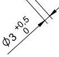
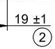
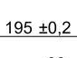

# 关键尺寸

## 已经支持的样式

<table data-view="cards" data-full-width="false"><thead><tr><th align="center">样式</th><th align="center">尺寸类型</th><th align="center">基准</th><th align="center">上偏差</th><th align="center">下偏差</th></tr></thead><tbody><tr><td align="center"></td><td align="center">φ</td><td align="center">3</td><td align="center">+0.5</td><td align="center">0</td></tr><tr><td align="center"></td><td align="center"></td><td align="center">19</td><td align="center">+1</td><td align="center">-1</td></tr><tr><td align="center"></td><td align="center"></td><td align="center">195</td><td align="center">+0.2</td><td align="center">-0.2</td></tr></tbody></table>


## 尚未支持的样式

近期更新


## 接口返回值



```json
{
    "guan_jian_chi_cun_xin_xi":
    [
        {
            "上偏差": "+1",
            "下偏差": "-1",
            "位置":
            [
                0.38810289389067526,
                0.8817005545286506,
                0.4041800643086817,
                0.8904805914972274
            ],
            "基准": "19",
            "尺寸类型": "",
            "数量": "",
            "最大值": "",
            "最小值": "",
            "置信度": 0.767578125,
            "页码": 1
        },
        {
            "上偏差": "+0.5",
            "下偏差": "0",
            "位置":
            [
                0.21028938906752412,
                0.5522181146025879,
                0.23665594855305466,
                0.5845656192236599
            ],
            "基准": "3",
            "尺寸类型": "φ",
            "数量": "",
            "最大值": "",
            "最小值": "",
            "置信度": 0.8056640625,
            "页码": 1
        },
        {
            "上偏差": "+0.2",
            "下偏差": "-0.2",
            "位置":
            [
                0.7536977491961415,
                0.019870609981515713,
                0.7810289389067524,
                0.030499075785582256
            ],
            "基准": "195",
            "尺寸类型": "",
            "数量": "",
            "最大值": "",
            "最小值": "",
            "置信度": 0.80810546875,
            "页码": 1
        }
    ]
}
```


