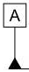
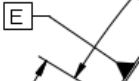

# 基准

## 已经支持的样式

<table data-view="cards" data-full-width="false"><thead><tr><th align="center">样式</th><th align="center">基准值</th></tr></thead><tbody><tr><td align="center"></td><td align="center">A</td></tr><tr><td align="center"></td><td align="center">E</td></tr></tbody></table>


## 尚未支持的样式

近期更新


## 接口返回值

```json
{
    "ji_zhun":
    [
        {
            "位置":
            [
                0.6109324758842444,
                0.23752310536044363,
                0.6196141479099678,
                0.27310536044362294
            ],
            "基准值": "A",
            "页码": 1
        },
        {
            "位置":
            [
                0.14330543933054393,
                0.21158129175946547,
                0.19142259414225943,
                0.25389755011135856
            ],
            "基准值": "E",
            "页码": 1
        }
    ]
}
```


