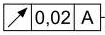
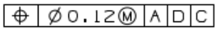

# 形位公差

## 已经支持的样式

<table data-view="cards" data-full-width="false"><thead><tr><th align="center">样式</th><th align="center">项目特征</th><th align="center">形位公差值</th><th align="center">实体要求</th><th align="center">尺寸类型</th><th>形位公差基准1</th><th>实体要求1</th><th>形位公差基准2</th><th>实体要求2</th><th>形位公差基准3</th><th>实体要求3</th></tr></thead><tbody><tr><td align="center"></td><td align="center">圆跳动</td><td align="center">0.02</td><td align="center"></td><td align="center"></td><td>A</td><td></td><td></td><td></td><td></td><td></td></tr><tr><td align="center"></td><td align="center">位置度</td><td align="center">0.010</td><td align="center">Ⓜ</td><td align="center">φ</td><td>Z</td><td></td><td>T</td><td>Ⓜ</td><td></td><td></td></tr><tr><td align="center"></td><td align="center">位置度</td><td align="center">0.12</td><td align="center">Ⓜ</td><td align="center">φ</td><td>A</td><td></td><td>D</td><td></td><td>C</td><td></td></tr></tbody></table>


## 已经支持的项目特征符号

<figure><figcaption></figcaption></figure>


## 尚未支持的样式

近期更新


## 接口返回值


```json
{
    "xing_wei_gong_cha":
    [
        {
            "位置":
            [
                0.8,
                0.7744916820702403,
                0.832475884244373,
                0.7888170055452866
            ],
            "实体要求": "",
            "实体要求1": "",
            "实体要求2": "",
            "实体要求3": "",
            "尺寸类型": "",
            "形位公差值": "0.02",
            "形位公差基准1": "A",
            "形位公差基准2": "",
            "形位公差基准3": "",
            "置信度": 0.93505859375,
            "页码": 1,
            "项目特征": "圆跳动"
        },
        {
            "位置":
            [
                0.5868200836820083,
                0.838158871566444,
                0.6778242677824268,
                0.8530066815144766
            ],
            "实体要求": "Ⓜ",
            "实体要求1": "",
            "实体要求2": "",
            "实体要求3": "",
            "尺寸类型": "φ",
            "形位公差值": "0.12",
            "形位公差基准1": "A",
            "形位公差基准2": "D",
            "形位公差基准3": "C",
            "置信度": 0.931640625,
            "页码": 1,
            "项目特征": "位置度"
        }
    ]
}
```

