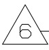

# 技术要求标识

## 已经支持的样式

<table data-full-width="false"><thead><tr><th align="center">样式</th><th align="center">内容</th></tr></thead><tbody><tr><td align="center"></td><td align="center">6</td></tr><tr><td align="center"></td><td align="center">7.</td></tr></tbody></table>


## 尚未支持的样式

近期更新


## 接口返回值

```json
{
    "notes_biaoshi":
    [
        {
            "位置":
            [
                0.7993553585817889,
                0.6525229357798165,
                0.814665592264303,
                0.6743119266055045
            ],
            "内容": "6",
            "置信度": 0.916015625,
            "页码": 1
        },
        {
            "位置":
            [
                0.9049153908138597,
                0.6055045871559633,
                0.9202256244963739,
                0.6261467889908257
            ],
            "内容": "7.",
            "置信度": 0.923828125,
            "页码": 1
        }
    ]
}
```


