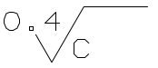
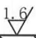

# 表面粗糙度

## 已经支持的样式

<table data-view="cards" data-full-width="false"><thead><tr><th align="center">样式</th><th align="center">取样长度</th><th align="center">纹路要求</th><th align="center">表面粗糙度</th><th>公差值</th></tr></thead><tbody><tr><td align="center"></td><td align="center"></td><td align="center"></td><td align="center">Ra</td><td>12.5</td></tr><tr><td align="center"></td><td align="center"></td><td align="center">顺纹抛光</td><td align="center"></td><td>0.4</td></tr><tr><td align="center"></td><td align="center"></td><td align="center"></td><td align="center"></td><td>1.6</td></tr></tbody></table>


## 尚未支持的样式

近期更新


## 接口返回值



```json
{
    "cu_cao_du": [
        {
            "位置": [
                0.5793714746172441,
                0.11353211009174312,
                0.5987107171635777,
                0.14105504587155962
            ],
            "公差值": "12.5",
            "取样长度": "",
            "纹路要求": "",
            "置信度": 0.8173828125,
            "表面粗糙度": "Ra",
            "页码": 1
        },
        {
            "位置": [
                0.4383561643835616,
                0.09403669724770643,
                0.46011281224818695,
                0.12155963302752294
            ],
            "公差值": "0.4",
            "取样长度": "",
            "纹路要求": "顺纹抛光",
            "置信度": 0.83203125,
            "表面粗糙度": "",
            "页码": 1
        },
        {
            "位置": [
                0.46978243352135374,
                0.10665137614678899,
                0.48992747784045126,
                0.13302752293577982
            ],
            "公差值": "0.8",
            "取样长度": "",
            "纹路要求": "",
            "置信度": 0.83740234375,
            "表面粗糙度": "",
            "页码": 1
        }
    ]
}
```


