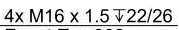
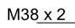
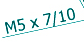

# 螺纹

## 已经支持的样式

<table data-view="cards"><thead><tr><th>样式</th><th>数量</th><th>深度</th><th>牙套长度</th><th>精度</th><th>螺纹型号</th><th>螺距</th><th>螺纹类型</th></tr></thead><tbody><tr><td></td><td>4×</td><td>↧22/26</td><td></td><td></td><td>M16</td><td>1.5</td><td></td></tr><tr><td></td><td></td><td></td><td></td><td></td><td>M38</td><td>2</td><td></td></tr><tr><td></td><td></td><td></td><td></td><td></td><td>M5</td><td>7/10</td><td></td></tr></tbody></table>


## 尚未支持的样式

近期更新


## 接口返回值



```json
{
    "luo_wen": [
        {
            "位置": [
                0.2661731573865465,
                0.04815481548154815,
                0.3237850016092694,
                0.05670567056705671
            ],
            "数量": "4×",
            "深度": "",
            "牙套长度": "",
            "精度": "",
            "置信度": 0.51953125,
            "螺纹型号": "M16",
            "螺纹类型": "",
            "螺距": "1.5",
            "页码": 1
        }
    ]
}
```


