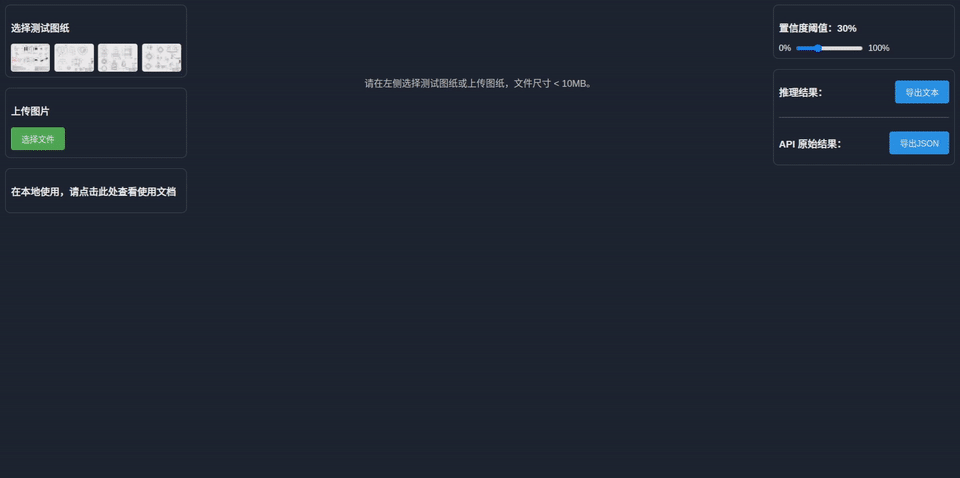
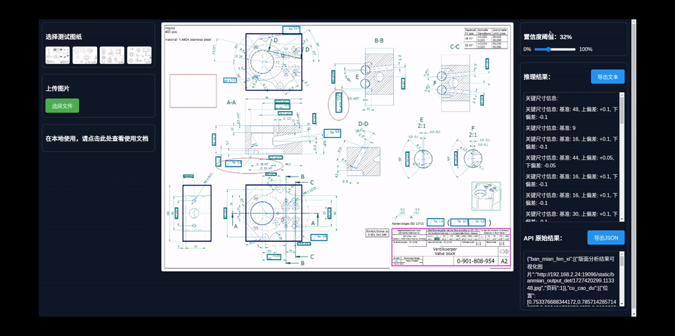

# 通过浏览器使用

您可以打开浏览器，访问 [http://api.holdingsky.cn/](http://api.holdingsky.cn/) ，点击 选择文件 按钮，上传一张图纸文件（支持 PDF、JPG、PNG 格式），系统将自动返回所有的识别结果。

## 步骤1：上传图纸

<figure><figcaption>
上传图纸
</figcaption></figure>

## 步骤2：导出简单的推理结果

<figure><figcaption>
导出txt
</figcaption></figure>

## 步骤3：导出完整的推理结果（JSON 格式）

<figure><figcaption>
导出json
</figcaption></figure>
