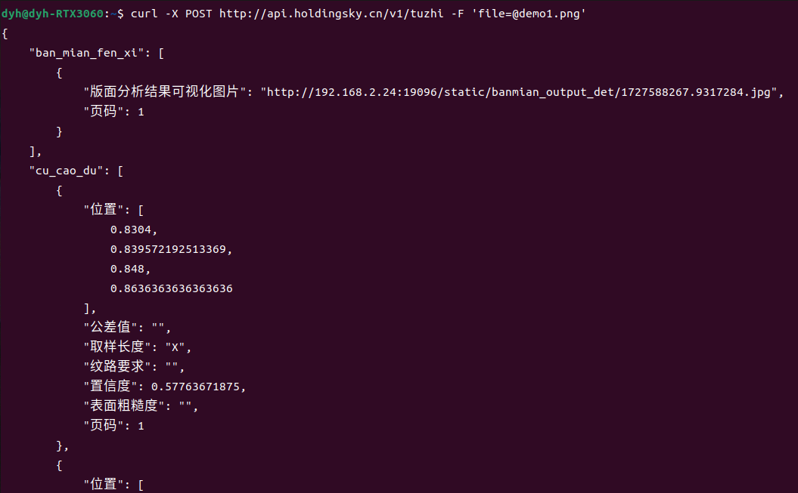

# 通过API接口使用

您可以使用命令行或任意编程语言，通过发送POST请求到API接口来使用图纸识别系统。&#x20;

您还可以基于 JSON 返回结果进行二次开发，灵活定制，以满足个性化需求。


## 接口地址


在以下命令中，请将 `demo1.png` 替换为您本地的图纸文件路径。

支持的文件类型包括 PDF、JPG 和 PNG。




<pre class="language-bash"><code class="lang-bash"><strong>curl -X POST http://api.holdingsky.cn/v1/tuzhi -F 'file=@demo1.png'
</strong></code></pre>



```python
import requests

url = "http://api.holdingsky.cn/v1/tuzhi"
file_path = 'demo1.png'
with open(file_path, 'rb') as file:
    files = {'file': file}
    response = requests.post(url, files=files)
    print(response.json())
```



```html
<!DOCTYPE html>
<html lang="en">
<head></head>
<body>
    <input type="file" id="fileInput">
    <script>
        document.getElementById('fileInput').addEventListener('change', async function() {
            const file = this.files[0];
            const url = "http://api.holdingsky.cn/v1/tuzhi";
            const formData = new FormData();
            formData.append('file', file);
            const response = await fetch(url, {
                method: 'POST',
                body: formData
            });
            const jsonResponse = await response.json();
            console.log("Response received:", jsonResponse);
        });
    </script>
</body>
</html>
```



```csharp
using System;
using System.Net.Http;
using System.IO;

class Program
{
    static void Main(string[] args)
    {
        string url = "http://api.holdingsky.cn/v1/tuzhi";
        string filePath = "demo1.png";
        using var client = new HttpClient();
        using var fileStream = new FileStream(filePath, FileMode.Open, FileAccess.Read);
        using var fileContent = new StreamContent(fileStream);
        using var content = new MultipartFormDataContent
        {
            { fileContent, "file", Path.GetFileName(filePath) }
        };
        var response = client.PostAsync(url, content).Result;
        response.EnsureSuccessStatusCode();
        var responseContent = response.Content.ReadAsStringAsync().Result;
        Console.WriteLine(responseContent);
    }
}
```



<figure><figcaption><p>cURL结果图片</p></figcaption></figure>


## 接口返回值

> [有关接口参数和返回值的详细信息，请访问此处。](api-parameter-details.md)

